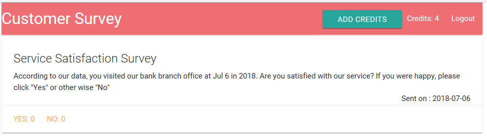

# Customer Survey App by React, Node, and MongoDB

## Front : React (reduxThunk, reduxForm, and stripe)
## Back : Node (express, mongoose, passport, google-oauth, sendgrid, and stripe )

## App Structure :
#### Login and Logout
#### Payments for Email Survey
#### Email Build and Customer Data Record  
#### Main Page
##### 

#### 1. Google Oauth
####      - logging in and out the application through 3rd party accounts which is Google at this app
####      - serializing and deserializing user login data 
####      - and utilizing passport, cookie-session, and mongoose
##### 
##### 

#### 2. Stripe Payments
####      - routing the user to get his/sher credit authorized from the sengrid server
####      - importing react-stripe-checkout module in frontend (react)
####      - and implementing mongoose to store user's credit information
##### 
##### 

#### 3. Sendgrid Email
####      - providing a form (at front) where the user builds and sends the email survey to their customers
####      - implementing the route handlers coworking with sendgrid library to send user's survey emails to their customers 
####      - storing email data and customer feedbacks in the database for the user to collect the customer data
####      - and implementing mongoose, express, sendgrid module
##### [Email Form]
##### 
##### [Survey List]
##### 
##### [Email Arrival]
##### 
##### [Email Content]
##### 
##### [Survey Feedback]
######  (When the customer clicks "Yes" in the email contents)
##### 

